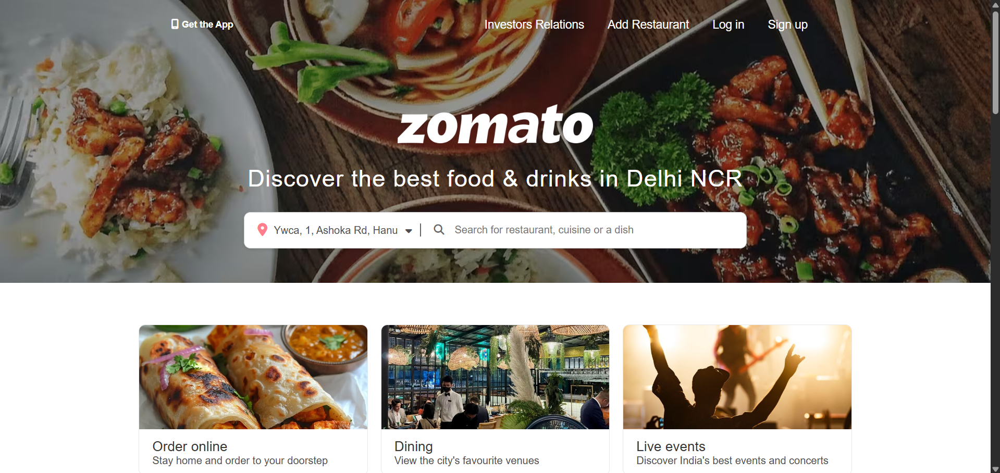
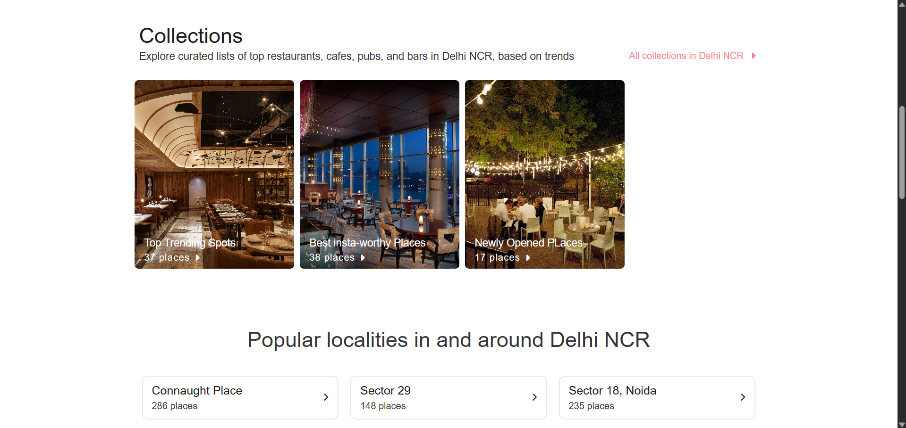
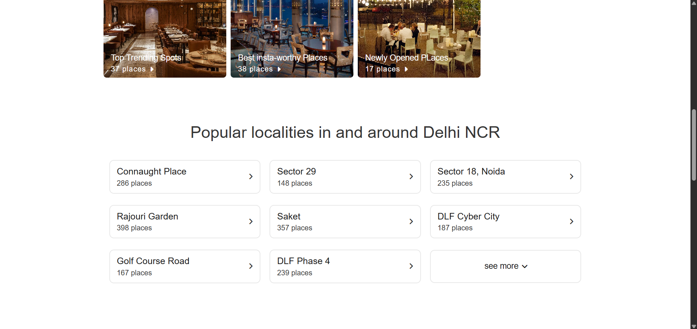
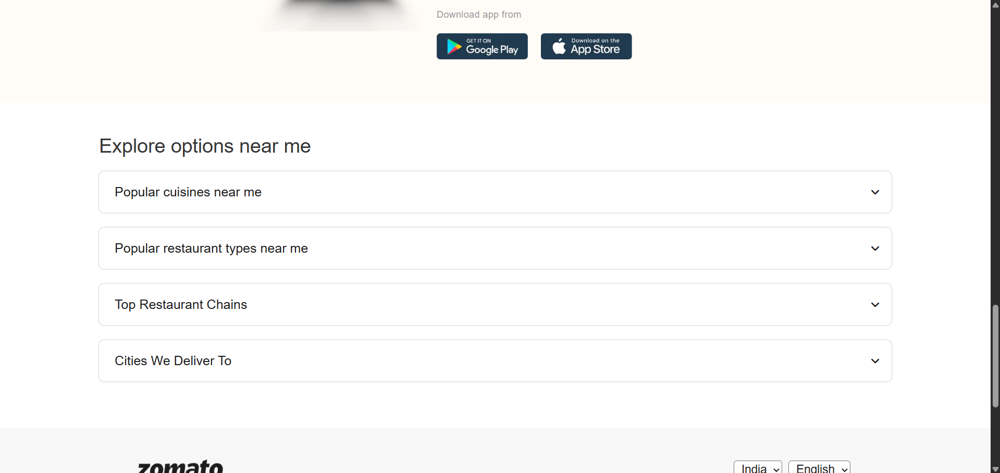
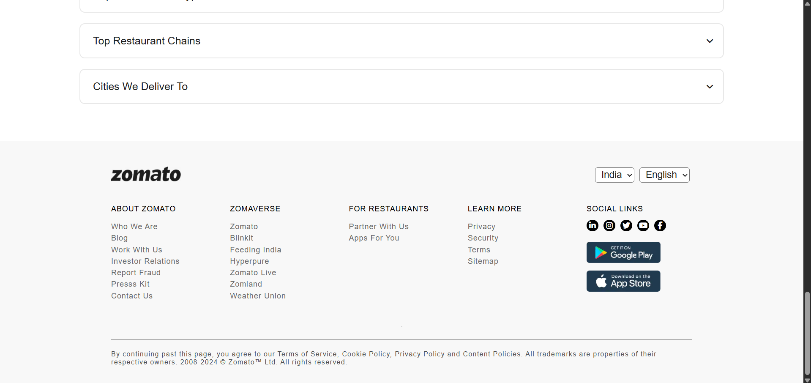
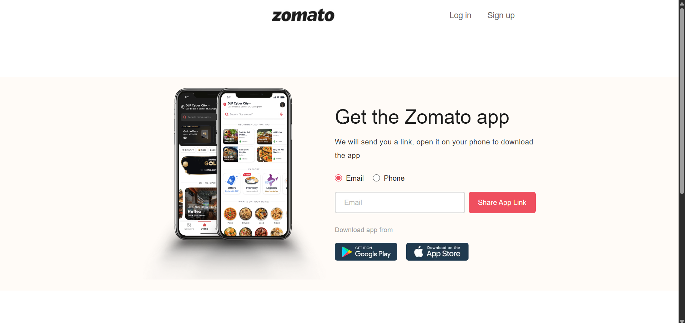

# 🍕 Zomato Website Clone

A **Zomato Website Clone** built using **HTML, CSS, and JavaScript**, enhanced with **Font Awesome icons** for an appealing and interactive design.  
The goal of this project was to replicate the **Zomato homepage UI** while adding interactive features such as search functionality, location-based options, and animated sections.  

✅ **Fully responsive across all screen sizes** — from desktops to tablets and smartphones!  

---

## 📸 Screenshots

| Preview 1 | Preview 2 |
|------------|------------|
|  |  |

| Preview 3 | Preview 4 |
|------------|------------|
|  |  |

| Preview 5 | Preview 6 |
|------------|------------|
|  |  |

---

## 🚀 Features

- 🎯 **Responsive Navbar:** Includes options for logging in, signing up, and adding a restaurant.  
- 🌍 **Location-Based Search Bar:** Search for restaurants, cuisines, and dishes easily.  
- 🍔 **Interactive Option Boxes:** Sections for online ordering, dining out, and live events.  
- 📌 **Collection Section:** Displays trending spots, Instagram-worthy places, and new restaurant openings.  
- 🏙️ **Popular Localities:** Lists well-known food hubs around Delhi NCR.  
- 📱 **“Get the Zomato App” Section:** Users can enter phone or email to receive the app link.  
- 🖥️ **Smooth Scrolling & Dropdowns:** Added JavaScript interactivity for a dynamic experience.  
- 📎 **Footer Section:** Contains important links and social media icons.  
- 💻 **Fully Responsive Design:** Optimized for desktop, tablet, and mobile screens.  

---

## 🛠️ Technologies Used

- 🧱 **HTML5:** For the structure and layout of the website.  
- 🎨 **CSS3:** For styling, responsiveness, and animations.  
- ⚡ **JavaScript (Vanilla JS):** For interactivity and UI functionality.  
- 🌟 **Font Awesome:** For icons in the navigation, search bar, and footer.  

---

## 🧩 JavaScript Functionalities

- 📍 **Toggle Display:** Switch between phone and email options in the app section.  
- 🔍 **Expandable Explore Section:** Expands to show more options dynamically.  
- 🎭 **Hover Effects:** Interactive animations on collection and restaurant boxes.  

---

## 🎯 How to Run the Project

1️⃣ Clone the repository:
```bash
  git clone https://github.com/TonyStark-19/Zomato-Website-clone.git
```

2️⃣ Open the project folder:
```bash
  cd Zomato-Website-clone
```

3️⃣ Open the `index.html` file in your browser.

---

## 🌟 Acknowledgments

- 🍕 [Zomato](https://www.zomato.com) for design inspiration.
- 💡 Inspired by modern web design and responsive development practices.

---

⭐ If you like this project, don’t forget to star the repository!

