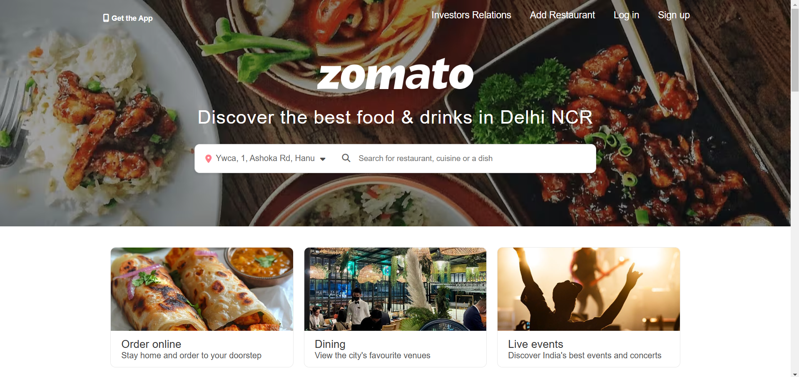

# Zomato Website Clone

This project is a clone of the Zomato website built using HTML, CSS, and Font Awesome icons. The goal is to replicate the homepage design of Zomato and provide functionality such as search, collection display, and restaurant recommendations.

## Screenshots

### Homepage :

## Features

- Responsive Navbar with options for logging in, signing up, and adding a restaurant.
- Location-based search bar for restaurants, cuisines, and dishes.
- Interactive boxes showcasing food ordering, dining, and live events.
- Collection section for trending spots, Instagram-worthy places, and newly opened restaurants.
- Popular localities section listing key restaurant areas around Delhi NCR.
- "Get the Zomato App" section with email/phone input options.
- Footer with various informational links and social media icons.

## Technologies Used

- **HTML5**: Used for structuring the webpage.
- **CSS3**: Used for styling and layout, including responsive design.
- **Font Awesome**: Used for icons in the navbar, search bar, and footer.
